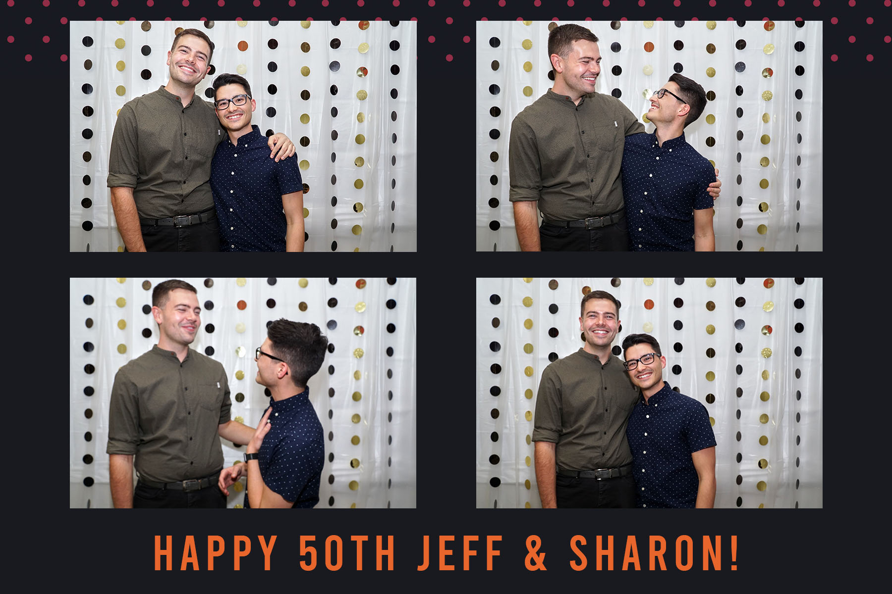
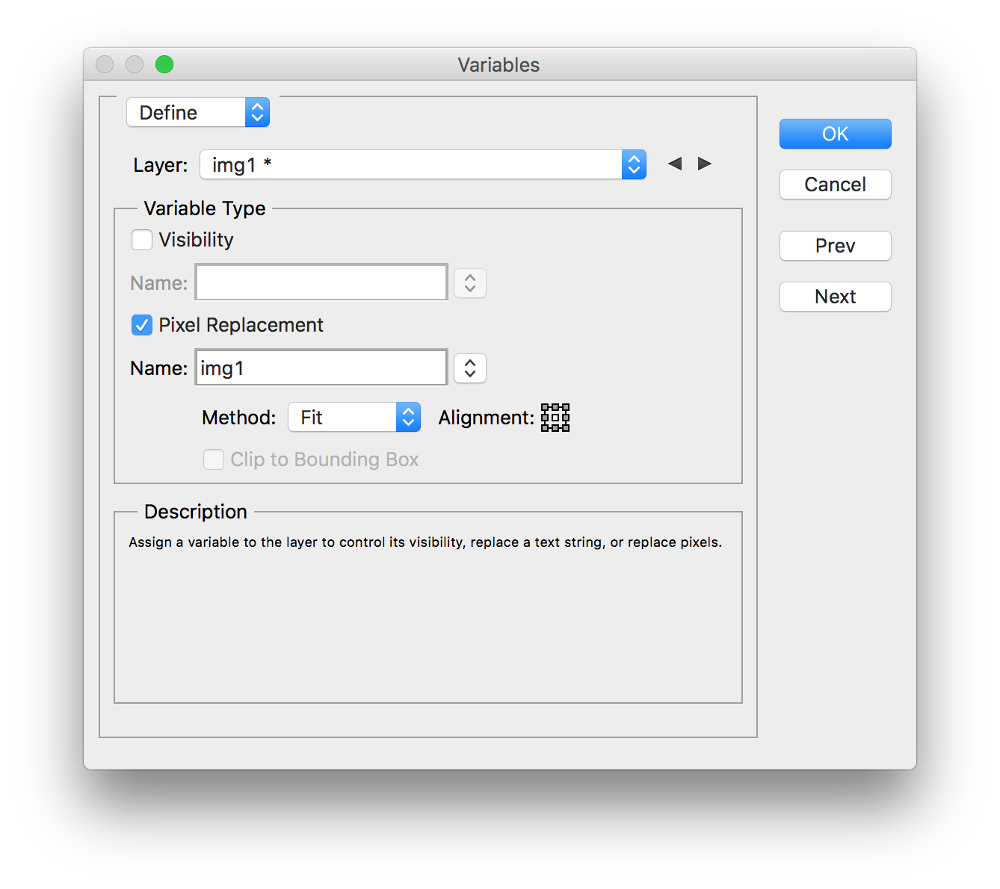
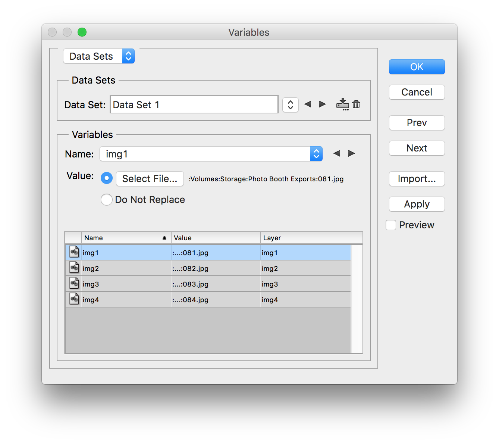
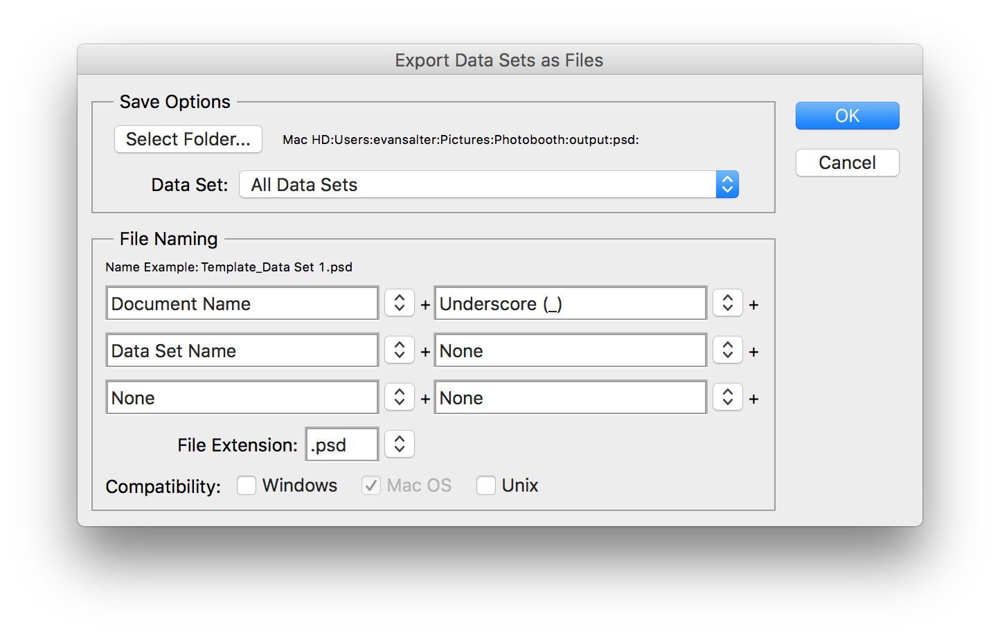
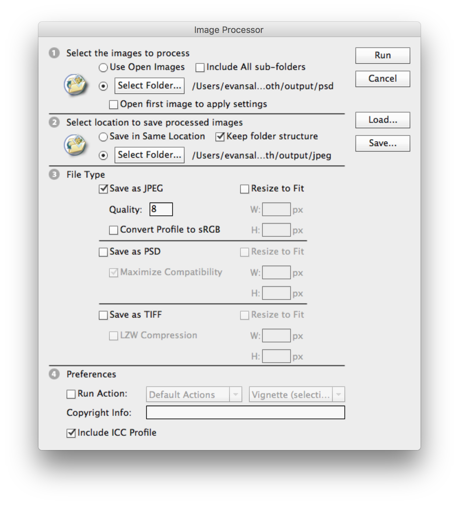

*This post is a continuation of [My $0 Photo Booth Setup](/blog/my-0-photo-booth-setup).*

After a successful evening with the photo booth, I had over 230 pictures to deal with. The goal was to lightly edit each photo and create collages of each photo booth session. I'd like to share my process here, hopefully providing inspiration or assistance for those looking to do something similar.

### Editing the Photos

I wanted to do a very quick edit of all the photos. I imported them into Capture One, selected all, and ran auto-adjustments. This got them to a pretty good place.

Next, I wanted to ensure the crop was good on the photos. Since the camera was on a tripod all night and didn't move, I just cropped the first photo and copied that adjustment to the rest.

After adjusting the crop of a few photos with particularly tall people, I exported them all to JPEGs.

### Creating the Collages

Now that I had the raw images in pretty good shape, I wanted to create collages or photo strips of each group of 4 photos. I wanted the collages to be styled nicely and have some sort of messaging related to the evening. I also wanted to automate the process, as I wasn't keen on manually making ~60 of these.

#### Step 1: Grouping the Images

There were a couple moments in the night when the camera took 3 images instead of 4, or I took a test shot and didn't delete it. Because of this, I didn't have exactly 4 images per session. To fix this, I simply switched to a thumbnail view in Capture One (you could also do this in a file broswer) and adjusted the zoom until there were 4 pictures in each row. This made it simple to quickly scan and find where there were extra pictures. I just deleted the extra ones until the total nmumber of images was divisible by 4.

#### Step 2: Creating the Template

I opened up Photoshop CS6 and created a new 4 x 6 document. I imported 4 images from the shoot as smart objects, arranged them, and added a background and some text. This was the final result:



I saved this as `template.psd`.

#### Step 3: Define the Variables

In order to automatically create each collage, I needed to create a variable for each of the images. To do so go to Image > Variables > Define...

In the dialog window, do the following

1. Select the layer that has your first image in the Layer dropdown
1. Check off Pixel Replacement, under Variable Type
1. Enter a name for the variable
1. Leave the method as Fit
1. Repeat for each of the other image layers



#### Step 4: Create the Data Sets

Now that the variables are defined, we need to create a CSV that tells photoshop which images to use for each variable. The CSV should be in the following format:

```sh
<var 1>,<var 2>,<var 3>,<var 4>
/path/to/image/1,/path/to/image/2,/path/to/image/3,/path/to/image/4
```

When we process the file, a new `psd` will be created for each row, with the images referenced for each variable.

I wrote a quick Python script to loop over all the pictures and create a row for every batch of 4:

```python
import csv
import os

file_path = '/Volumes/Storage/Photo Booth Exports'

rows = []

num = 1
row = []
for file in os.listdir(file_path):
    row.append(u'{}/{}'.format(file_path, file))
    if len(row) == 4:
        rows.append(row)
        row = []
        num += 1

print(rows)    

with open('data_sets.csv', mode='w') as f:
    writer = csv.writer(f)
    writer.writerow(['img1', 'img2', 'img3', 'img4'])
    for r in rows:
        writer.writerow(r)
```

The output looked something like this:

```sh
img1,img2,img3,img4
/Volumes/Storage/Photo Booth Exports/081.jpg,/Volumes/Storage/Photo Booth Exports/082.jpg,/Volumes/Storage/Photo Booth Exports/083.jpg,/Volumes/Storage/Photo Booth Exports/084.jpg
/Volumes/Storage/Photo Booth Exports/085.jpg,/Volumes/Storage/Photo Booth Exports/086.jpg,/Volumes/Storage/Photo Booth Exports/087.jpg,/Volumes/Storage/Photo Booth Exports/088.jpg
/Volumes/Storage/Photo Booth Exports/089.jpg,/Volumes/Storage/Photo Booth Exports/090.jpg,/Volumes/Storage/Photo Booth Exports/091.jpg,/Volumes/Storage/Photo Booth Exports/092.jpg
...
```

#### Step 5: Processing the Data Sets

Back in Photoshop, we need to import the Data Set file we created. To do so, select Image > Variables > Data Sets..., then choose Import in the dialog box. Select the csv you created, uncheck "Use First Column For Data Set Names" and hit OK, then OK again.



To process the data sets, select File > Export > Data Sets as Files. Then, select an output directory and "All Data Sets", and optionally modify the naming scheme below. When you are ready, click OK.



Photoshop will run for a while, creating the PSD files for each row in the CSV. Once it is done you can open one or more of them up and verify it looks how you want.

#### Step 6: Exporting the Collages as JPEGs

You likely want to export the images for sharing. Luckily, there's an easy way to batch export PSDs to JPEGs (or any other format).

In Photoshop, go to File > Scripts > Image Processor. First, choose the folder containing the PSDs from Step 5. Next, choose the folder to output the processed images to. Select the file type and options, then click Run.



That's it! After the processing is complete, your output folder should contain JPEG versions of all of your collages.

All in, this process probably took 2 hours. That's including transferring the pictures to my NAS, waiting for exports, and learning how to automate Photoshop like this. I would guess this could all be done in an hour if you have your Photoshop template done before hand.